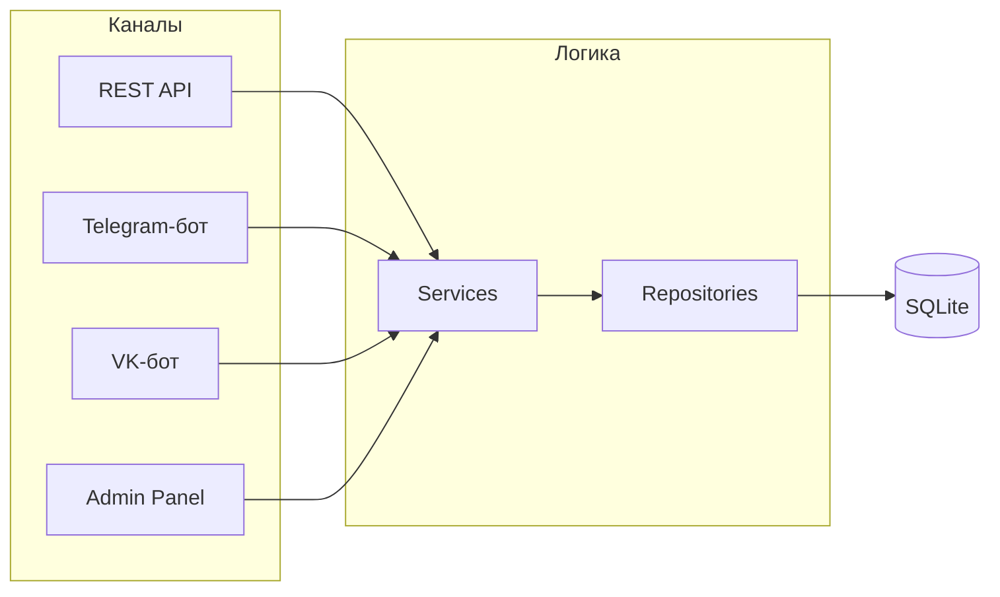

# reservation-service

Монорепа: Express API + Telegram-бот + VK-бот + React-фронт + Админ-панель.

## Функционал

Сервис бронирования с интеграцией Telegram:
- Пользователь видит календарь со свободными датами и временем
- Выбирает удобный слот
- Нажимает кнопку "Забронировать"
- Перенаправляется в Telegram с предзаполненным сообщением о выбранной дате и времени

## Структура

```
reservation-service/
├── backend/          # Express + Telegraf (Telegram Bot API)
│   ├── src/
│   │   ├── index.ts                  # точка входа
│   │   ├── types.ts                  # типы (Business, TimeSlot, SlotStatus, ContactLink)
│   │   ├── bot/                      # Telegram-бот
│   │   │   ├── index.ts              # инициализация Telegraf
│   │   │   ├── handlers.ts           # обработчики команд и callback
│   │   │   ├── formatters.ts         # форматирование сообщений
│   │   │   └── parsers.ts            # NLP-парсинг команд
│   │   ├── vk-bot/                   # VK-бот (Long Poll)
│   │   │   ├── index.ts              # инициализация VK, Long Poll
│   │   │   ├── handlers.ts           # обработчики сообщений и кнопок
│   │   │   └── keyboard.ts           # адаптер клавиатур VK
│   │   ├── routes/
│   │   │   ├── api.ts                # REST API расписания (клиентский)
│   │   │   └── admin.ts              # Admin API (auth + команды чата)
│   │   ├── services/
│   │   │   ├── db.ts                 # SQLite init, бэкапы, версионированные миграции
│   │   │   ├── business.ts           # CRUD бизнесов, slug, соглашения, контактные ссылки
│   │   │   ├── schedule.ts           # реэкспорт из slot.repository
│   │   │   ├── auth.ts               # регистрация, вход, JWT, bcrypt
│   │   │   ├── command.ts            # выполнение команд (реюз из bot/)
│   │   │   ├── booking-notifications.ts # уведомления в TG/VK о новых заявках на бронирование
│   │   │   ├── monitor.ts            # мониторинг: алерты, /health, дайджест
│   │   │   └── demo.ts              # демо-баня: автосоздание + ежедневные записи (cron)
│   │   ├── repositories/
│   │   │   ├── slot.repository.ts    # слоты: CRUD, бронирование, статистика
│   │   │   ├── admin-user.repository.ts # admin_users, link_codes, reset_tokens
│   │   │   └── booking-request.repository.ts # CRUD заявок на бронирование
│   │   └── utils/
│   │       └── date.ts               # даты, форматирование, дни недели
│   ├── data/
│   │   └── reservations.db           # файл БД (создаётся автоматически)
│   ├── Dockerfile
│   └── package.json
├── frontend/         # React (Vite) — клиентский фронт
│   ├── src/
│   │   ├── App.tsx
│   │   └── components/
│   ├── vite.config.ts
│   └── package.json
├── admin/            # React (Vite) — админ-панель (чат + визуальный календарь)
│   ├── src/
│   │   ├── App.tsx
│   │   ├── pages/         # LoginPage, RegisterPage, ChatPage, CalendarPage, ResetPasswordPage, RequestsPage, SettingsPage
│   │   └── components/    # ChatMessage, ChatInput, BusinessSwitcher, CommandList, BurgerMenu
│   ├── vite.config.ts
│   └── package.json
├── shared/           # Shared-компоненты (локальная библиотека)
│   └── calendar/     # Переиспользуемый компонент календаря
│       └── src/
│           ├── index.ts         # реэкспорт Calendar, DaySlot
│           ├── Calendar.tsx     # месячный вид + дневной таймлайн
│           └── Calendar.css     # стили календаря
├── landing/          # Статический лендинг (SEO)
│   ├── index.html           # исходник с {{ADMIN_URL}} плейсхолдером
│   ├── styles.css           # стили лендинга
│   ├── media/               # медиа-файлы (видео, скриншоты)
│   └── dist/                # собранный лендинг (после build:landing)
├── nginx/            # Nginx конфиги
│   ├── nginx.conf         # основной конфиг (HTTPS + проксирование)
│   └── nginx-init.conf    # временный конфиг (HTTP, для получения SSL)
├── scripts/
│   ├── deploy.sh              # единый деплой (backend + frontend + nginx)
│   ├── init-letsencrypt.sh    # первичное получение SSL-сертификата
│   ├── deploy-backend.sh     # (legacy) деплой бэкенда
│   └── deploy-frontend.sh    # (legacy) деплой фронтенда на GitHub Pages
├── docker-compose.yml         # backend + nginx + certbot
└── package.json               # npm workspaces root
```

### Архитектура бэкенда

Подробная документация, диаграммы и гайдлайны — в [`backend/README.md`](backend/README.md).



## Быстрый старт

```bash
# Установка зависимостей (из корня)
npm install

# Создать .env файл для бэкенда
cp backend/.env.example backend/.env
# Вписать BOT_TOKEN и TELEGRAM_BOT_USERNAME в backend/.env

# Создать .env файл для фронтенда
cp frontend/.env.example frontend/.env

# Запуск бэкенда (dev, с --watch)
npm run dev:back

# Запуск фронта (Vite dev server)
npm run dev:front
```

## Переменные окружения

### Backend (`backend/.env`)

| Переменная              | Описание                                | Пример                          |
|-------------------------|-----------------------------------------|---------------------------------|
| `BOT_TOKEN`             | Токен Telegram-бота                     | `123456:ABC-DEF...`             |
| `TELEGRAM_BOT_USERNAME` | Username бота (без @)                   | `my_bot`                        |
| `FRONTEND_URL`          | URL фронтенда (для ссылок в боте)       | `http://192.168.0.23:5173`      |
| `PORT`                  | Порт сервера                            | `3000`                          |
| `DB_DIR`                | Путь к папке с БД (по умолчанию `./data`) | `/app/data`                   |
| `JWT_SECRET`            | Секрет для JWT-токенов админ-панели        | `random-secret-string`          |
| `ADMIN_URL`             | URL админ-панели (для ссылок в боте)       | `https://admin.slotik.tech`     |
| `MONITOR_BOT_TOKEN`     | Токен отдельного Telegram-бота для мониторинга (алерты, `/health`, дайджест). Если не задан — мониторинг не активируется | `123456:ABC-DEF...` |
| `VK_BOT_TOKEN`          | Токен ключа доступа VK-сообщества. Если не задан — VK-бот не запускается | `vk1.a.xxxxx...` |
| `VK_GROUP_ID`           | ID VK-сообщества (группы) | `123456789` |
| `METRIKA_COUNTER_ID`    | ID счётчика Яндекс Метрики. Используется при сборке лендинга (`build:landing`). Если не задан — код Метрики не встраивается | `12345678` |

### Frontend (`frontend/.env`)

| Переменная                 | Описание                                | Пример                              |
|----------------------------|-----------------------------------------|--------------------------------------|
| `VITE_TELEGRAM_BOT_USERNAME` | Username бота для кнопки бронирования | `my_bot`                             |
| `VITE_API_URL`             | URL бэкенда (см. ниже)                  | `http://192.168.0.23:3000/api`       |

#### Как фронтенд находит бэкенд

- **Dev-режим без `VITE_API_URL`:** запросы идут на `/api`, Vite проксирует их на `http://localhost:3000` (настроено в `vite.config.ts`). Работает, если фронт и бэк на одной машине.
- **Dev-режим с `VITE_API_URL`:** запросы идут напрямую на указанный URL. Нужно, если тестируешь с телефона или другого устройства в локальной сети — задай `VITE_API_URL=http://<IP-бэкенда>:3000/api`.
- **Production:** фронтенд отдаётся nginx, запросы к `/api` проксируются на бэкенд. `VITE_API_URL` не нужен.

### Admin (`admin/.env`)

| Переменная                 | Описание                                | Пример                              |
|----------------------------|-----------------------------------------|--------------------------------------|
| `VITE_API_URL`             | URL бэкенда (аналогично frontend)       | `http://192.168.0.23:3000`           |
| `VITE_METRIKA_COUNTER_ID`  | ID счётчика Яндекс Метрики. Если не задан — Метрика не подключается | `12345678` |

## Docker

```bash
# Поднять в контейнере
docker-compose up -d --build

# Остановить
docker-compose down
```

## База данных

SQLite (`better-sqlite3`), файл `data/reservations.db`. Создаётся автоматически при первом запуске.

**Версионированные миграции:** схема отслеживается через таблицу `_migrations`. При запуске применяются только новые миграции, каждая в транзакции (откат при ошибке).

**Автоматические бэкапы:**
- При каждом запуске приложения (если БД не пустая) создаётся копия в `data/backups/`
- При каждом деплое через CI/CD — бэкап перед перезапуском контейнера
- Ротация: хранится максимум 10 последних бэкапов

**Мониторинг целостности:** если в production БД пустая (0 бизнесов, 0 admin_users), приложение логирует WARNING и шлёт алерт в мониторинг-бот.

### Таблица `businesses`

| Колонка                | Тип            | Описание                              |
|------------------------|----------------|---------------------------------------|
| `id`                   | INTEGER, PK    | Автоинкремент                         |
| `slug`                 | TEXT, UNIQUE   | URL-идентификатор бани                 |
| `name`                 | TEXT           | Название бани                          |
| `owner_chat_id`        | TEXT           | ID владельца: число (Telegram) или `vk:ID` (VK) |
| `telegram_username`    | TEXT           | Telegram username владельца            |
| `owner_phone`          | TEXT           | Телефон владельца (из Telegram-контакта, не отдаётся через API) |
| `agreement_accepted_at`| TEXT           | Дата принятия пользовательского соглашения |
| `created_at`           | TEXT           | Дата создания                          |
| `booking_requests_enabled` | BOOLEAN      | Включены ли заявки на бронирование (DEFAULT 0) |

### Таблица `owner_agreements`

| Колонка          | Тип          | Описание                                 |
|------------------|--------------|------------------------------------------|
| `owner_chat_id`  | TEXT, PK     | ID владельца: число (Telegram) или `vk:ID` (VK) |
| `accepted_at`    | TEXT         | Дата принятия пользовательского соглашения|

### Таблица `slots`

| Колонка        | Тип          | Описание                                  |
|----------------|--------------|-------------------------------------------|
| `id`           | INTEGER, PK  | Автоинкремент                             |
| `business_id`  | INTEGER, FK  | Ссылка на `businesses.id`                 |
| `date_key`     | TEXT         | Дата в формате `YYYY-MM-DD`               |
| `start_time`   | TEXT         | Время начала `HH:MM` (произвольные минуты)|
| `end_time`     | TEXT         | Время конца `HH:MM` (произвольные минуты) |
| `status`       | TEXT         | `available` / `booked` / `blocked`        |
| `note`         | TEXT         | Комментарий (кем/чем занято)              |
| `client_name`  | TEXT         | Имя клиента                               |
| `client_phone` | TEXT         | Телефон клиента                           |

Индекс по `(business_id, date_key)`. Бронирования через полночь: `end_time < start_time`.

### Таблица `booking_requests`

| Колонка          | Тип          | Описание                                  |
|------------------|--------------|-------------------------------------------|
| `id`             | INTEGER, PK  | Автоинкремент                             |
| `business_id`    | INTEGER, FK  | Ссылка на `businesses.id`                 |
| `client_name`    | TEXT         | Имя клиента                               |
| `client_phone`   | TEXT         | Телефон клиента                           |
| `description`    | TEXT         | Описание заявки                           |
| `preferred_date` | TEXT         | Желаемая дата (YYYY-MM-DD)                |
| `preferred_time` | TEXT         | Желаемое время                            |
| `status`         | TEXT         | `pending` / `approved` / `rejected`       |
| `created_at`     | TEXT         | Дата создания                             |
| `updated_at`     | TEXT         | Дата обновления                           |

### Таблица `contact_links`

| Колонка        | Тип          | Описание                                  |
|----------------|--------------|-------------------------------------------|
| `id`           | INTEGER, PK  | Автоинкремент                             |
| `business_id`  | INTEGER, FK  | Ссылка на `businesses.id`                 |
| `type`         | TEXT         | `telegram` / `vk` / `max`                |
| `url`          | TEXT         | Полная ссылка (https://...)               |

UNIQUE constraint на `(business_id, type)`. При удалении бизнеса ссылки удаляются каскадно.

### Таблица `admin_users`

| Колонка          | Тип          | Описание                                 |
|------------------|--------------|------------------------------------------|
| `id`             | INTEGER, PK  | Автоинкремент                            |
| `email`          | TEXT, UNIQUE | Email пользователя                       |
| `password_hash`  | TEXT         | bcrypt-хеш пароля                        |
| `owner_chat_id`  | TEXT, NULL   | Связь с Telegram (из businesses)         |
| `created_at`     | TEXT         | Дата регистрации                         |

### Таблица `link_codes`

| Колонка          | Тип          | Описание                                 |
|------------------|--------------|------------------------------------------|
| `id`             | INTEGER, PK  | Автоинкремент                            |
| `code`           | TEXT         | 6-значный код привязки                   |
| `owner_chat_id`  | TEXT         | Telegram chat ID владельца               |
| `expires_at`     | TEXT         | Время истечения                          |
| `used`           | INTEGER      | 0/1                                      |

### Таблица `reset_tokens`

| Колонка          | Тип          | Описание                                 |
|------------------|--------------|------------------------------------------|
| `id`             | INTEGER, PK  | Автоинкремент                            |
| `token`          | TEXT, UNIQUE | UUID-токен для сброса пароля             |
| `admin_user_id`  | INTEGER, FK  | Ссылка на admin_users.id                 |
| `expires_at`     | TEXT         | Время истечения                          |
| `used`           | INTEGER      | 0/1                                      |

Путь к файлу БД настраивается через переменную `DB_DIR` (по умолчанию `./data`).
В Docker данные сохраняются через volume `./data:/app/data`.

### Просмотр БД локально

```bash
sqlite3 -header -column backend/data/reservations.db "SELECT * FROM businesses;"
sqlite3 -header -column backend/data/reservations.db "SELECT * FROM slots;"
```

## API

### Мультитенант (по slug)

| Метод    | Путь                                          | Описание                        |
|----------|-----------------------------------------------|---------------------------------|
| `GET`    | `/api/business/:slug`                         | Информация о бане               |
| `GET`    | `/api/business/:slug/available-dates`         | Даты со свободными слотами      |
| `GET`    | `/api/business/:slug/day-slots?date=YYYY-MM-DD` | Все слоты на конкретную дату |
| `POST`   | `/api/business/:slug/booking-requests`        | Создать заявку на бронирование  |

### Admin API (admin.slotik.tech)

| Метод    | Путь                              | Описание                              | Auth |
|----------|-----------------------------------|---------------------------------------|------|
| `POST`   | `/admin/auth/register`            | Регистрация (email + пароль)          | Нет  |
| `POST`   | `/admin/auth/login`               | Вход (email + пароль)                 | Нет  |
| `POST`   | `/admin/auth/reset-password`      | Сброс пароля по токену                | Нет  |
| `GET`    | `/admin/me`                       | Текущий пользователь + заведения      | JWT  |
| `GET`    | `/admin/commands`                 | Список доступных команд               | JWT  |
| `POST`   | `/admin/command`                  | Выполнить команду чата                | JWT  |
| `POST`   | `/admin/init`                     | Инициализация чата (начальные сообщения) | JWT |
| `POST`   | `/admin/link-telegram`            | Привязка Telegram по коду             | JWT  |
| `GET`    | `/admin/calendar/dates`           | Все даты со слотами (для календаря)   | JWT  |
| `GET`    | `/admin/calendar/slots`           | Слоты на дату (с clientName/Phone)    | JWT  |
| `POST`   | `/admin/calendar/booking`         | Создать запись из календаря            | JWT  |
| `PUT`    | `/admin/calendar/booking/:id`     | Редактировать запись из календаря      | JWT  |
| `DELETE` | `/admin/calendar/booking/:id`     | Отменить запись из календаря           | JWT  |
| `POST`   | `/admin/calendar/schedule`        | Задать расписание на день              | JWT  |
| `GET`    | `/admin/booking-requests?businessId=&status=` | Список заявок на бронирование | JWT  |
| `PUT`    | `/admin/booking-requests/:id`     | Обновить заявку (статус, перенос)      | JWT  |
| `GET`    | `/admin/settings?businessId=`     | Настройки бизнеса                      | JWT  |
| `PUT`    | `/admin/settings`                 | Обновить настройки бизнеса             | JWT  |

### Legacy (обратная совместимость, business_id=1)

| Метод    | Путь                              | Описание                              |
|----------|-----------------------------------|---------------------------------------|
| `GET`    | `/health`                         | Health check                          |
| `GET`    | `/api/available-dates`            | Даты со свободными слотами            |
| `GET`    | `/api/day-slots?date=YYYY-MM-DD`  | Все слоты на конкретную дату          |

## Админ-панель

Веб-интерфейс для управления заведениями — чат в стиле ChatGPT + визуальный календарь в стиле Google Calendar. Два режима работы переключаются через нижний таб-бар (Чат / Календарь).

- **URL:** `https://admin.slotik.tech` (dev: `http://localhost:5174`)
- **Авторизация:** email + пароль (без внешних сервисов)
- **Сброс пароля:** через Telegram-бота (команда `/reset`)

### Привязка Telegram / VK

Если у владельца уже есть заведения в Telegram-боте или VK-боте, он может привязать их к веб-аккаунту:

1. Владелец регистрируется на `admin.slotik.tech` (email + пароль)
2. В боте (Telegram или VK) отправляет команду `/link`
3. Бот отвечает 6-значным кодом (действителен 10 минут)
4. Владелец вводит код в веб-панели (кнопка 🔗 в шапке)
5. Аккаунт привязывается — все заведения из бота доступны в веб-панели

Если мессенджера нет — заведение можно создать прямо из веб-чата (при первом входе автоматически запускается диалог создания).

### Запуск (dev)

```bash
npm run dev:back    # бэкенд (порт 3000)
npm run dev:admin   # админ-панель (порт 5174)
```

## Мониторинг

При установленном `MONITOR_BOT_TOKEN` запускается отдельный Telegram-бот для мониторинга.

### Настройка

1. Добавить `MONITOR_BOT_TOKEN=<токен>` в `backend/.env`
2. Написать [@slotik_monitoring_bot](https://t.me/slotik_monitoring_bot) `/start` — он запомнит chat ID и начнёт отправлять алерты

### Алерты об ошибках

Автоматически отправляются при:
- `uncaughtException` / `unhandledRejection`
- Ошибках Express (500)

Rate limiting: не более 1 алерта в 60 секунд. Стектрейс обрезается до 1000 символов.

### Команда `/health`

Возвращает: uptime, RAM (rss/heap), количество бизнесов и слотов.

### Ежедневный дайджест

Каждый день в 09:00 MSK отправляется отчёт: uptime, RAM, количество бизнесов, слотов, бронирований за 24 часа.

Если `MONITOR_BOT_TOKEN` не задан — мониторинг не активируется, сервис работает как раньше.

## Production

| | |
|---|---|
| **Домен** | `slotik.tech` |
| **IP сервера** | `185.255.132.151` |
| **URL** | `https://slotik.tech` |
| **API** | `https://slotik.tech/api/*` |
| **Админ-панель** | `https://admin.slotik.tech` |
| **Бот** | [@slotik_tech_bot](https://t.me/slotik_tech_bot) |
| **Мониторинг-бот** | [@slotik_monitoring_bot](https://t.me/slotik_monitoring_bot) |

## Лендинг

Статический HTML-лендинг для SEO. Раздаётся nginx на `/`, React SPA — на `/:slug`.

CTA-ссылки ведут на регистрацию в админ-панели (`ADMIN_URL`). Видео и скриншоты лежат в `landing/media/` (пользователь кладёт файлы сам, см. `landing/media/README.md`).

```bash
# Сборка (подставляет ADMIN_URL из backend/.env или переменной окружения)
npm run build:landing

# Или с явным указанием
ADMIN_URL=https://admin.slotik.tech npm run build:landing
```

Результат — `landing/dist/` (index.html, styles.css, media/). При деплое nginx раздаёт на корневой URL.

## Деплой

Деплой автоматический через **GitHub Actions** — push в `main` запускает сборку и деплой на сервер.

### GitHub Secrets

Настраиваются в репозитории: **Settings → Secrets and variables → Actions → Repository secrets**.

| Secret | Описание | Пример |
|---|---|---|
| `SSH_PRIVATE_KEY` | Приватный SSH-ключ для подключения к серверу. GitHub Actions использует его для rsync и ssh-команд. Генерируется через `ssh-keygen`, публичная часть должна быть в `~/.ssh/authorized_keys` на сервере | содержимое файла `~/.ssh/deploy_key` |
| `DEPLOY_HOST` | IP-адрес сервера, на который деплоится проект | `185.255.132.151` |
| `DEPLOY_USER` | SSH-пользователь на сервере | `root` |
| `DEPLOY_PATH` | Абсолютный путь на сервере, куда кладётся проект | `/opt/reservation-service` |

### Подготовка сервера (один раз)

```bash
ssh root@185.255.132.151

# 1. Docker и docker-compose
apt-get update && apt-get install -y docker.io rsync
curl -SL -o /usr/local/bin/docker-compose \
  https://github.com/docker/compose/releases/latest/download/docker-compose-linux-x86_64
chmod +x /usr/local/bin/docker-compose
docker-compose version  # проверить

# 2. Создать директорию проекта
mkdir -p /opt/reservation-service

# 3. Создать backend/.env с секретами (не попадает в git)
mkdir -p /opt/reservation-service/backend
cat > /opt/reservation-service/backend/.env <<'EOF'
BOT_TOKEN=<токен бота>
PORT=3000
NODE_ENV=production
FRONTEND_URL=https://slotik.tech
EOF
```

### Первый деплой (инициализация SSL)

```bash
# 1. Push в master → GitHub Actions задеплоит проект
# 2. На сервере: получить SSL-сертификат
ssh root@185.255.132.151
cd /opt/reservation-service
bash scripts/init-letsencrypt.sh
```

### Ручной деплой (если нужно)

```bash
DEPLOY_HOST=185.255.132.151 DEPLOY_USER=root npm run deploy
```
