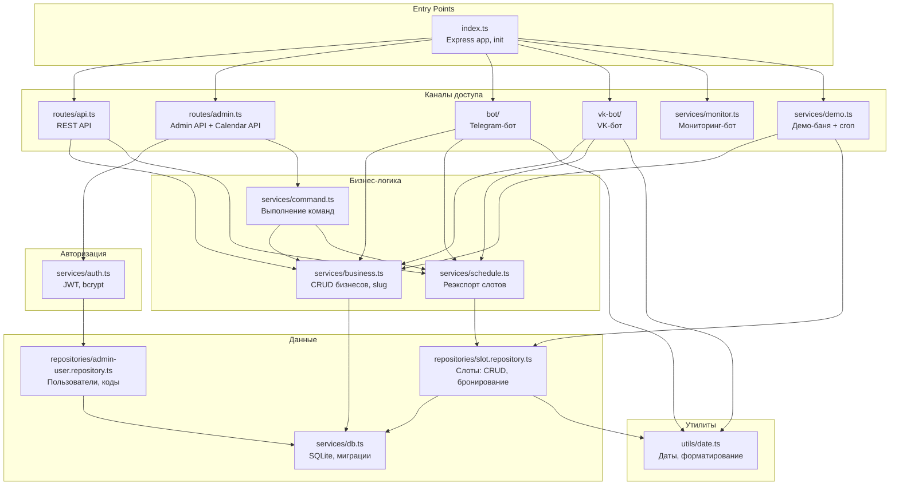
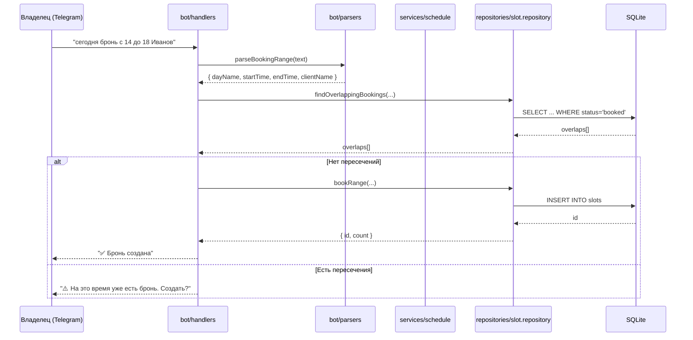
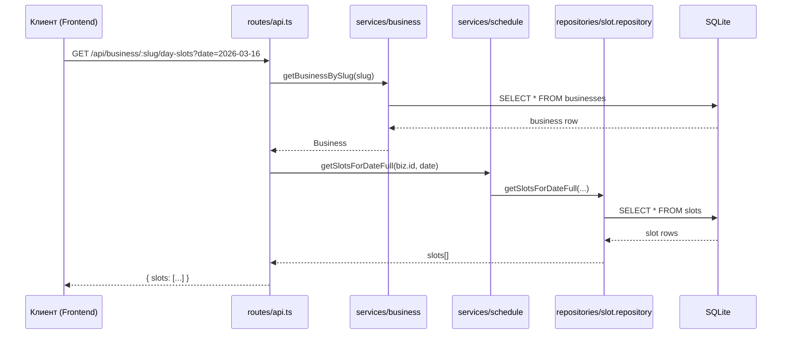

# Backend — reservation-service

Express API + Telegram-бот + VK-бот для управления бронированиями.

## Архитектура

Слоистая архитектура с разделением по ответственности. Три канала доступа (REST API, Telegram-бот и VK-бот) работают через общий слой сервисов и репозиториев.



### Поток данных при бронировании



### Поток данных REST API



## Структура проекта

```
backend/
├── src/
│   ├── index.ts                          # Точка входа: Express, CORS, init
│   ├── types.ts                          # Типы: Business, TimeSlot, SlotStatus, ContactLink
│   │
│   ├── bot/                              # Telegram-бот (канал доступа)
│   │   ├── index.ts                      # Инициализация Telegraf, middleware
│   │   ├── handlers.ts                   # Обработчики команд и callback
│   │   ├── formatters.ts                 # Форматирование сообщений бота
│   │   ├── parsers.ts                    # NLP-парсинг команд на русском
│   │   └── __tests__/
│   │       ├── formatters.test.ts
│   │       └── parsers.test.ts
│   │
│   ├── vk-bot/                           # VK-бот (канал доступа, Long Poll)
│   │   ├── index.ts                      # Инициализация VK, Long Poll
│   │   ├── handlers.ts                   # Обработчики сообщений и callback-кнопок
│   │   └── keyboard.ts                   # Адаптер клавиатур VK + stripFormatting
│   │
│   ├── routes/                           # REST API (каналы доступа)
│   │   ├── api.ts                        # Express-роуты: /business/:slug/*
│   │   └── admin.ts                      # Admin API: auth, command, link, calendar
│   │
│   ├── services/                         # Бизнес-логика и инфраструктура
│   │   ├── db.ts                         # SQLite init, миграции, getDb()
│   │   ├── business.ts                   # CRUD бизнесов, slug, соглашения, контактные ссылки
│   │   ├── schedule.ts                   # Реэкспорт из slot.repository
│   │   ├── auth.ts                       # Регистрация, вход, JWT, bcrypt
│   │   ├── command.ts                    # Выполнение команд (реюз из bot/)
│   │   ├── monitor.ts                    # Мониторинг: алерты, /health, дайджест
│   │   ├── demo.ts                       # Демо-баня: автосоздание + ежедневные записи (cron)
│   │   └── __tests__/
│   │       └── business.test.ts
│   │
│   ├── repositories/                     # Доступ к данным (SQL-запросы)
│   │   ├── slot.repository.ts            # Слоты: выборка, бронирование, отмена
│   │   ├── admin-user.repository.ts      # Admin users, link codes, reset tokens
│   │   └── __tests__/
│   │       └── slot.repository.test.ts
│   │
│   └── utils/                            # Чистые утилиты без side-effects
│       ├── date.ts                       # Даты, форматирование, дни недели
│       └── __tests__/
│           └── date.test.ts
│
├── data/                                 # БД (создаётся автоматически)
│   └── reservations.db
├── Dockerfile
├── package.json
└── tsconfig.json
```

## Куда класть новый код

| Что добавляешь | Куда класть | Пример |
|---|---|---|
| Новый SQL-запрос или работа с таблицей | `repositories/*.repository.ts` | Поиск слотов, агрегации |
| CRUD-операции над бизнес-сущностью | `services/*.ts` | Создание/удаление бизнесов |
| Новый REST-эндпоинт (клиентский) | `routes/api.ts` | GET /api/business/:slug/stats |
| Новый Admin-эндпоинт | `routes/admin.ts` | POST /admin/command, Calendar API |
| Авторизация / JWT | `services/auth.ts` | Проверка токена, хеширование |
| Команда чата (web) | `services/command.ts` | Обработка текстовой команды |
| Новая команда Telegram-бота | `bot/handlers.ts` | Обработка /report |
| Новая команда VK-бота | `vk-bot/handlers.ts` | Обработка новой команды в VK |
| VK-клавиатура / утилиты | `vk-bot/keyboard.ts` | Адаптер кнопок для VK |
| Парсинг текста пользователя | `bot/parsers.ts` | Распознавание "перенеси бронь" |
| Форматирование ответа бота | `bot/formatters.ts` | Новый формат расписания |
| Новый тип или интерфейс | `types.ts` | Тип для нового отчёта |
| Чистая утилита (без БД, без IO) | `utils/*.ts` | Форматирование телефона |
| Инфраструктура (DB миграции) | `services/db.ts` | Новая колонка в таблице |
| Новая таблица (репозиторий) | `repositories/новая.repository.ts` | Отзывы, уведомления |

### Правила размещения

1. **Repositories** — только SQL-запросы и маппинг строк в объекты. Не содержат бизнес-логику.
2. **Services** — бизнес-логика, координация между репозиториями. Могут вызывать другие сервисы и репозитории.
3. **Routes / Bot handlers** — тонкие: валидация входных данных, вызов сервисов, форматирование ответа. Бизнес-логика — в сервисах.
4. **Utils** — чистые функции без side-effects, без зависимостей от БД или внешних сервисов.
5. **Types** — общие типы, используемые в нескольких слоях.

## Тестирование

### Что тестировать

| Слой | Приоритет | Что тестировать | Как тестировать |
|---|---|---|---|
| `utils/` | **Обязательно** | Все чистые функции | Юнит-тесты, без моков |
| `bot/parsers.ts` | **Обязательно** | Парсинг всех форматов команд | Юнит-тесты, без моков |
| `bot/formatters.ts` | **Обязательно** | Форматирование сообщений | Юнит-тесты, без моков |
| `repositories/` | **Обязательно** | CRUD-операции, граничные случаи | In-memory SQLite, мок `getDb()` |
| `services/` | **Обязательно** | Бизнес-логика (slug, CRUD, валидация) | In-memory SQLite, мок `getDb()` |
| `routes/` | Желательно | HTTP-ответы, валидация параметров | Supertest или моки |
| `bot/handlers.ts` | Желательно | Сценарии диалогов | Моки ctx + сервисов |

### Как писать тесты

**Расположение:** тесты лежат в `__tests__/` рядом с тестируемым модулем.

**Именование:** `<module-name>.test.ts`

**Для чистых функций (utils, parsers, formatters):**

```typescript
import { describe, it, expect } from 'vitest';
import { myFunction } from '../myModule';

describe('myFunction', () => {
  it('описание поведения', () => {
    expect(myFunction(input)).toBe(expected);
  });
});
```

**Для кода с БД (repositories, services):**

```typescript
import { describe, it, expect, vi, beforeEach, afterEach } from 'vitest';
import Database from 'better-sqlite3';

let testDb: Database.Database;

vi.mock('../db', () => ({
  getDb: () => testDb,
}));

import { myDbFunction } from '../myModule';

beforeEach(() => {
  testDb = new Database(':memory:');
  testDb.pragma('foreign_keys = ON');
  // создать таблицы
});

afterEach(() => {
  testDb.close();
});
```

### Запуск тестов

```bash
# Из корня проекта
npm test -w backend

# Из папки backend
npm test

# Конкретный файл
npx vitest run src/services/__tests__/business.test.ts
```

## Стек

| | |
|---|---|
| Runtime | Node.js 20 |
| Framework | Express 4 |
| DB | SQLite (better-sqlite3), WAL mode |
| Bot (Telegram) | Telegraf 4 |
| Bot (VK) | vk-io 4 |
| Tests | Vitest 4 |
| Dev | tsx (watch mode) |
| Build | TypeScript 5 → CommonJS |
