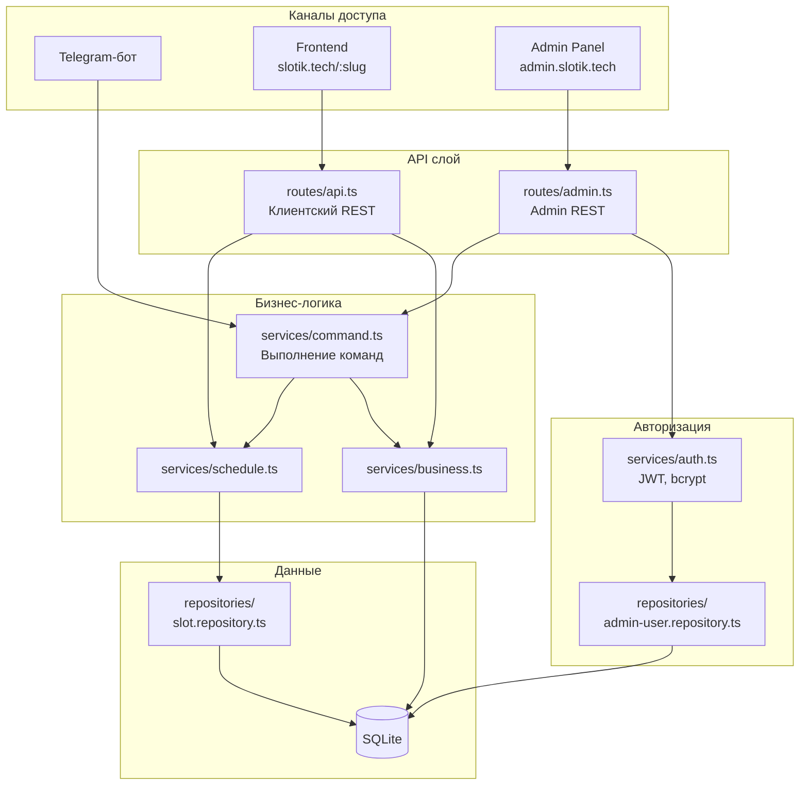
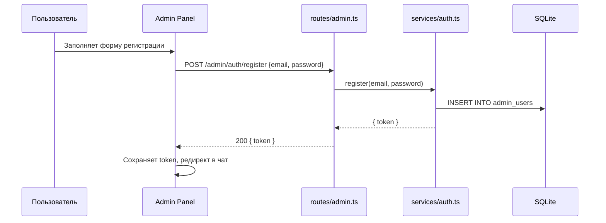
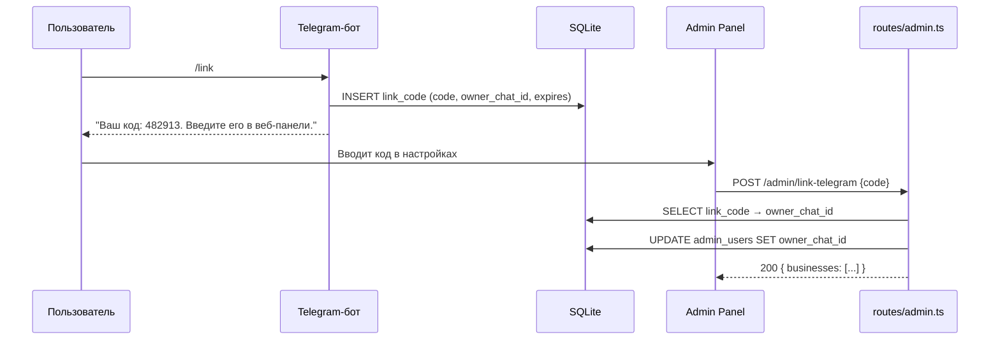
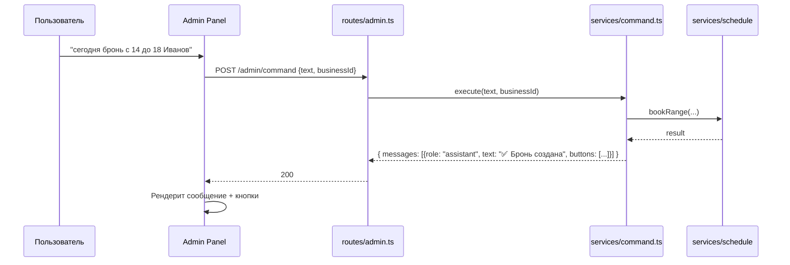

# Фича: Админ-панель (чат-интерфейс в браузере)

**Ветка:** `18-admin-panel`
**Создана:** 2026-03-16
**Статус:** реализовано

## Контекст

**Зачем:** Сейчас владельцы управляют расписанием только через Telegram-бота. Нужен веб-интерфейс — админ-панель в виде чата (по образцу ChatGPT), где можно отправлять те же команды. Это позволяет работать без Telegram и не зависеть от доступности сервиса в РФ.

**Что есть сейчас:** Все команды (бронирование, расписание, настройки, управление заведениями) работают только через Telegram-бота (`bot/handlers.ts`). REST API отдаёт данные для клиентского фронтенда (календарь со слотами), но не поддерживает управление.

**Решения по архитектуре:**

- **Авторизация:** email + пароль. Без OTP, без внешних сервисов (SMTP не нужен).
- **Привязка Telegram:** опциональная, через код из бота (команда `/link`).
- **Сброс пароля:** через Telegram-бота (команда `/reset` → ссылка для сброса). Если аккаунт не привязан к Telegram — сброс невозможен (MVP).
- **История чата:** не сохраняется между сессиями, чат начинается пустым.
- **Inline-кнопки:** отображаются как кликабельные элементы в чате (аналог кнопок Telegram).
- **Выбор заведения:** переключатель в шапке (как выбор модели в ChatGPT), а не вопрос при каждой команде.
- **Новый пользователь без заведений:** при первом входе автоматически запускается диалог создания заведения.
- **Расположение:** отдельное React-приложение (`admin/`), поддомен `admin.slotik.tech`.

## Архитектура

### Общая схема

```
reservation-service/
├── backend/          # Express + Telegraf + Admin API
│   └── src/
│       ├── routes/
│       │   ├── api.ts            # Существующий REST API (клиентский фронтенд)
│       │   └── admin.ts          # NEW: Admin API (auth + команды чата)
│       ├── services/
│       │   ├── auth.ts           # NEW: регистрация, вход, JWT, хеширование
│       │   └── command.ts        # NEW: выполнение команд (реюз логики из bot/handlers)
│       ├── repositories/
│       │   └── admin-user.repository.ts  # NEW: CRUD admin_users, link_codes
│       └── bot/
│           └── handlers.ts       # +команда /link, /reset
├── admin/            # NEW: React SPA (чат-интерфейс)
│   ├── src/
│   │   ├── App.tsx
│   │   ├── pages/
│   │   │   ├── LoginPage.tsx
│   │   │   ├── RegisterPage.tsx
│   │   │   └── ChatPage.tsx
│   │   └── components/
│   │       ├── ChatMessage.tsx
│   │       ├── ChatInput.tsx
│   │       ├── CommandList.tsx
│   │       ├── ActionButton.tsx
│   │       └── BusinessSwitcher.tsx
│   ├── vite.config.ts
│   └── package.json
└── nginx/
    └── nginx.conf    # +server block для admin.slotik.tech
```

### Потоки данных



### Поток авторизации



### Поток привязки Telegram



### Поток команды чата



## User Stories

### US-1 — Регистрация по email и паролю (Приоритет: P1)

Новый пользователь заходит на `admin.slotik.tech`, вводит email и пароль, создаёт аккаунт. После регистрации попадает в чат-интерфейс.

**Как проверить независимо:** Открыть `admin.slotik.tech`, заполнить форму, убедиться что аккаунт создан и пользователь в чате.

**Сценарии приёмки:**

1. **Дано** незарегистрированный пользователь, **Когда** он вводит email и пароль (>=8 символов), **Тогда** аккаунт создаётся, возвращается JWT, пользователь в чате.
2. **Дано** email уже зарегистрирован, **Когда** пользователь пытается зарегистрироваться, **Тогда** ошибка «Email уже зарегистрирован».
3. **Дано** пароль < 8 символов, **Когда** отправляет форму, **Тогда** ошибка валидации.

---

### US-2 — Вход по email и паролю (Приоритет: P1)

Зарегистрированный пользователь входит, указав email и пароль.

**Сценарии приёмки:**

1. **Дано** зарегистрированный пользователь, **Когда** вводит правильный email и пароль, **Тогда** возвращается JWT, попадает в чат.
2. **Дано** неверный пароль, **Когда** пытается войти, **Тогда** ошибка «Неверный email или пароль».

---

### US-3 — Чат-интерфейс для управления (Приоритет: P1)

Авторизованный пользователь видит интерфейс как в ChatGPT: область сообщений в центре, поле ввода внизу. Команды — те же, что в Telegram-боте.

**Сценарии приёмки:**

1. **Дано** пользователь с заведением, **Когда** отправляет «покажи расписание», **Тогда** ответ с расписанием на неделю.
2. **Дано** пользователь, **Когда** отправляет «сегодня бронь с 14 до 18 Иванов», **Тогда** бронь создаётся, ответ с подтверждением.
3. **Дано** пересечение бронирований, **Когда** пользователь создаёт бронь, **Тогда** ответ с предупреждением и кнопками «Да, создать» / «Нет».
4. **Дано** пользователь нажимает кнопку «Да, создать», **Тогда** бронь создаётся.
5. **Дано** пользователь без заведения и без привязки Telegram, **Когда** входит в чат, **Тогда** запускается диалог регистрации заведения (аналог /start).
6. **Дано** нераспознанная команда, **Тогда** ответ со списком доступных команд.

---

### US-4 — Список команд / подсказки (Приоритет: P2)

В чате есть кнопка/иконка «Команды», по нажатию — список доступных команд с описаниями. Клик по команде вставляет текст в поле ввода.

**Сценарии приёмки:**

1. **Дано** пользователь в чате, **Когда** нажимает «Команды», **Тогда** список с описаниями.
2. **Дано** список открыт, **Когда** кликает команду, **Тогда** текст вставляется в поле ввода.

---

### US-5 — Привязка Telegram через код (Приоритет: P2)

Пользователь, у которого уже есть заведения в Telegram-боте, привязывает их к веб-аккаунту через одноразовый код.

**Сценарии приёмки:**

1. **Дано** пользователь в Telegram-боте, **Когда** отправляет `/link`, **Тогда** бот отвечает 6-значным кодом (действителен 10 минут).
2. **Дано** пользователь в веб-панели, **Когда** вводит код, **Тогда** `owner_chat_id` привязывается к его `admin_user`, он видит свои заведения.
3. **Дано** код истёк или уже использован, **Когда** вводит код, **Тогда** ошибка.

---

### US-6 — Сброс пароля через Telegram (Приоритет: P3)

Пользователь забыл пароль. Если аккаунт привязан к Telegram — в боте команда `/reset`, бот присылает ссылку для сброса.

**Сценарии приёмки:**

1. **Дано** аккаунт привязан к Telegram, **Когда** пользователь отправляет `/reset`, **Тогда** бот присылает ссылку `admin.slotik.tech/reset?token=...` (действительна 30 минут).
2. **Дано** ссылка действительна, **Когда** пользователь вводит новый пароль, **Тогда** пароль обновлён.
3. **Дано** аккаунт не привязан к Telegram, **Тогда** сброс невозможен (MVP).

---

## Ключевые сущности

### Новая таблица `admin_users`

| Колонка | Тип | Описание |
|---|---|---|
| `id` | INTEGER, PK | Автоинкремент |
| `email` | TEXT, UNIQUE | Email пользователя |
| `password_hash` | TEXT | bcrypt-хеш пароля |
| `owner_chat_id` | TEXT, NULL | Связь с Telegram (из `businesses.owner_chat_id`) |
| `created_at` | TEXT | Дата регистрации |

### Новая таблица `link_codes`

| Колонка | Тип | Описание |
|---|---|---|
| `id` | INTEGER, PK | Автоинкремент |
| `code` | TEXT | 6-значный код |
| `owner_chat_id` | TEXT | Telegram chat ID владельца |
| `expires_at` | TEXT | Время истечения |
| `used` | INTEGER | 0/1 |

### Новая таблица `reset_tokens`

| Колонка | Тип | Описание |
|---|---|---|
| `id` | INTEGER, PK | Автоинкремент |
| `token` | TEXT, UNIQUE | UUID-токен |
| `admin_user_id` | INTEGER, FK | Ссылка на `admin_users.id` |
| `expires_at` | TEXT | Время истечения |
| `used` | INTEGER | 0/1 |

### API эндпоинты (`routes/admin.ts`)

| Метод | Путь | Описание | Auth |
|---|---|---|---|
| `POST` | `/admin/auth/register` | Регистрация | Нет |
| `POST` | `/admin/auth/login` | Вход | Нет |
| `POST` | `/admin/command` | Выполнить команду чата | JWT |
| `POST` | `/admin/link-telegram` | Привязка Telegram по коду | JWT |
| `POST` | `/admin/auth/reset-password` | Сброс пароля по токену | Нет |
| `GET` | `/admin/me` | Текущий пользователь + заведения | JWT |

### Nginx (`admin.slotik.tech`)

Отдельный `server` блок:
- `admin.slotik.tech` → статика из `admin/dist/`
- `/admin/*` проксируется на бэкенд `localhost:3000`
- SSL через certbot (отдельный сертификат или расширение существующего)

## Edge Cases

- Пользователь зарегистрировался в вебе, но не привязал Telegram и не создал заведение → при входе в чат запускается диалог создания заведения (аналог /start).
- Пользователь привязал Telegram, но потом удалил заведение из бота → при входе в веб видит пустой список, может создать новое.
- Два веб-аккаунта привязаны к одному Telegram → невозможно: при привязке проверяем, не занят ли `owner_chat_id`.
- JWT истёк → фронт получает 401, редиректит на страницу логина.
- Несколько заведений у одного владельца → переключатель заведения в шапке, команды выполняются для выбранного.

## Критерии приёмки

- [x] Страница регистрации: email + пароль → аккаунт создан, JWT в localStorage, редирект в чат
- [x] Страница входа: email + пароль → JWT, редирект в чат
- [x] Валидация: email формат, пароль >= 8 символов, дублирование email
- [x] JWT middleware: запросы к `/admin/*` (кроме auth) без/с невалидным токеном → 401
- [x] `POST /admin/command` принимает текст + businessId, возвращает `{ messages: [...] }` с текстом и кнопками
- [x] Все команды бота работают через веб-чат: бронирование, отмена, расписание, время работы, настройки, /add, /del, /list
- [x] Кнопки в ответах (подтверждение брони, отмена) кликабельны и вызывают `POST /admin/command` с action
- [x] Переключатель заведений в шапке: dropdown с названиями, выбранное сохраняется в state
- [x] Новый пользователь без заведений → автоматический диалог создания заведения
- [x] Список команд: кнопка «Команды», popup со списком, клик → вставка в поле ввода
- [x] `/link` в Telegram-боте → 6-значный код, `POST /admin/link-telegram` привязывает owner_chat_id
- [x] `/reset` в Telegram-боте → ссылка для сброса пароля (30 мин), страница сброса работает
- [x] UI в стиле ChatGPT: тёмная тема, область сообщений по центру, поле ввода внизу
- [x] Nginx: `admin.slotik.tech` → статика + проксирование `/admin/*` на бэкенд
- [x] Таблицы `admin_users`, `link_codes`, `reset_tokens` созданы миграцией в `services/db.ts`

## Задачи

### Backend

- [x] Миграция БД: таблицы `admin_users`, `link_codes`, `reset_tokens` в `services/db.ts`
- [x] `repositories/admin-user.repository.ts` — CRUD admin_users, link_codes, reset_tokens
- [x] `services/auth.ts` — register, login, verifyToken (JWT), hashPassword, comparePassword (bcrypt)
- [x] `services/command.ts` — извлечённая логика из `bot/handlers.ts`, возвращает `{ messages, buttons }`
- [x] `routes/admin.ts` — эндпоинты: register, login, command, init, link-telegram, reset-password, me, commands
- [x] JWT middleware для защиты admin-эндпоинтов
- [x] Подключить `routes/admin.ts` в `index.ts`
- [x] Команда `/link` в `bot/handlers.ts` — генерация и сохранение 6-значного кода
- [x] Команда `/reset` в `bot/handlers.ts` — генерация reset-токена, отправка ссылки
- [x] Переменные `JWT_SECRET`, `ADMIN_URL` в `.env.example`
- [x] Зависимости: `bcryptjs`, `jsonwebtoken`

### Admin frontend

- [x] Инициализация проекта: `admin/` — Vite + React + TypeScript
- [x] Роутинг: `/login`, `/register`, `/reset`, `/` (чат)
- [x] `LoginPage.tsx` — форма email + пароль
- [x] `RegisterPage.tsx` — форма email + пароль
- [x] `ResetPasswordPage.tsx` — форма нового пароля (по токену из URL)
- [x] `ChatPage.tsx` — основной экран чата
- [x] `ChatMessage.tsx` — рендер сообщений (user/assistant) с кнопками
- [x] `ChatInput.tsx` — поле ввода + кнопка отправки (Enter)
- [x] `CommandList.tsx` — popup со списком команд и описаниями
- [x] `BusinessSwitcher.tsx` — dropdown выбора заведения в шапке
- [x] `LinkTelegram.tsx` — компонент привязки Telegram по коду
- [x] Auth context: хранение JWT, auto-redirect на login при 401
- [x] API client: fetch-обёртка с JWT header
- [x] UI стиль ChatGPT: центрированная область чата, тёмная тема, адаптив

### Nginx & deploy

- [ ] DNS: A-запись `admin.slotik.tech → 185.255.132.151` — создать в панели регистратора домена
- [x] `nginx/nginx.conf`: server block для `admin.slotik.tech`
- [x] `docker-compose.yml`: volume `./admin-dist:/usr/share/nginx/admin:ro`
- [x] `deploy.yml`: сборка `admin/` + rsync `admin/dist/` → `admin-dist/` на сервере
- [x] `deploy.sh`: аналогичные шаги для ручного деплоя

#### SSL: certbot для поддомена (выполнить один раз на сервере)

**Предварительно:** DNS A-запись `admin.slotik.tech` должна быть создана и распространена.

```bash
ssh root@185.255.132.151
cd /opt/reservation-service

# Расширить сертификат на поддомен
docker run --rm \
  -v "$(pwd)/certbot/conf:/etc/letsencrypt" \
  -v "$(pwd)/certbot/www:/var/www/certbot" \
  certbot/certbot certonly \
  --webroot --webroot-path=/var/www/certbot \
  --email admin@slotik.tech --agree-tos --no-eff-email \
  -d slotik.tech -d admin.slotik.tech --expand

# Перезапустить nginx
docker-compose restart nginx
```

#### JWT_SECRET и ADMIN_URL (выполнить один раз на сервере)

```bash
ssh root@185.255.132.151

# Сгенерировать секрет
JWT_SECRET=$(openssl rand -base64 32)

# Добавить переменные в backend/.env
cat >> /opt/reservation-service/backend/.env <<EOF
JWT_SECRET=${JWT_SECRET}
ADMIN_URL=https://admin.slotik.tech
EOF

# Перезапустить бэкенд
cd /opt/reservation-service && docker-compose up -d --build backend
```

| Переменная | Зачем | Без неё |
|---|---|---|
| `JWT_SECRET` | Подпись JWT-токенов авторизации | Используется `dev-secret-change-in-production` — небезопасно, токены можно подделать |
| `ADMIN_URL` | URL для ссылок в боте (`/link`, `/reset`) | Дефолт `https://admin.slotik.tech` — ок для production |

### Документация

- [x] Обновить `README.md` — структура, переменные окружения, архитектура
- [x] Обновить `backend/README.md` — новые модули, диаграммы, таблица «Куда класть код»
